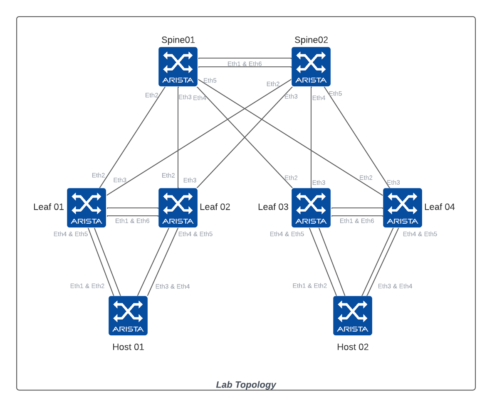

# Ansible AVD TOI

This repository provides content to execute labs for an AVD TOI based on Arista ATD environment.



## Lab 01 - Installation

```bash
cd labfiles
git clone https://github.com/titom73/ansible-avd-toi.git
Cloning into 'ansible-avd-toi'...
remote: Enumerating objects: 55, done.
remote: Counting objects: 100% (55/55), done.
remote: Compressing objects: 100% (30/30), done.
remote: Total 55 (delta 18), reused 55 (delta 18), pack-reused 0
Receiving objects: 100% (55/55), 26.80 KiB | 3.35 MiB/s, done.
Resolving deltas: 100% (18/18), done.
```

## Lab 02 - Check ansible Installation

__Check Ansible version__

```bash
ansible --version
ansible [core 2.12.3]
  config file = /home/coder/.ansible.cfg
  configured module search path = ['/home/coder/.ansible/plugins/modules', '/usr/share/ansible/plugins/modules']
  ansible python module location = /usr/local/lib/python3.9/dist-packages/ansible
  ansible collection location = /home/coder/.ansible/collections:/usr/share/ansible/collections
  executable location = /usr/local/bin/ansible
  python version = 3.9.2 (default, Feb 28 2021, 17:03:44) [GCC 10.2.1 20210110]
  jinja version = 3.0.3
  libyaml = True
```

__Check Ansible Collection__

```bash
ansible-galaxy collection list

# /home/coder/.ansible/collections/ansible_collections
Collection        Version
----------------- -------
ansible.netcommon 2.5.1
ansible.posix     1.3.0
ansible.utils     2.5.1
arista.avd        3.3.2
arista.cvp        0.0.0
arista.eos        4.1.1
community.general 4.5.0
```

__Install & Update Collection__

```bash
ansible-galaxy collection install --force collection.yml
```

## Lab 03 - EOS CLI CONFIG GEN

Playbook to use for lab03:

```bash
ansible-playbook playbooks/eos_cli_config_gen.yml -i eos-cli-config-gen-lab/inventory.yml

PLAY [Manage Arista EOS EVPN/VXLAN Configuration]
*************************************************
[ ... ]
```

## Lab 04 - EOS Designs

Playbook to use for lab03:

```bash
ansible-playbook playbooks/eos_designs.yml -i eos-designs-lab/inventory.yml

PLAY [Manage Arista EOS EVPN/VXLAN Configuration]
*************************************************
[ ... ]
```

## License

Repository under [Apache2 License](./LICENSE)

## Authors

@titom73
